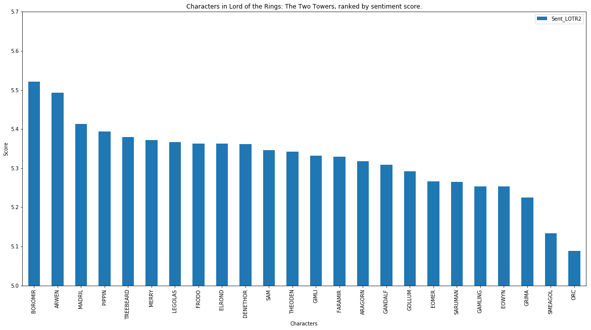
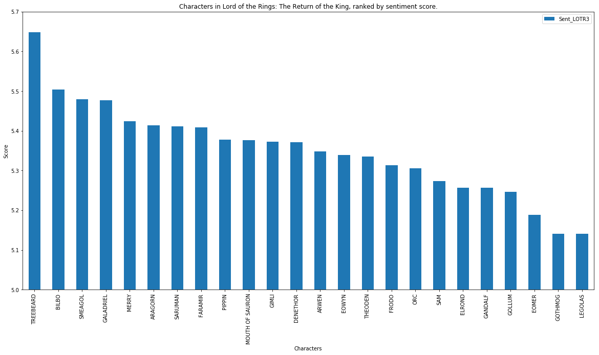
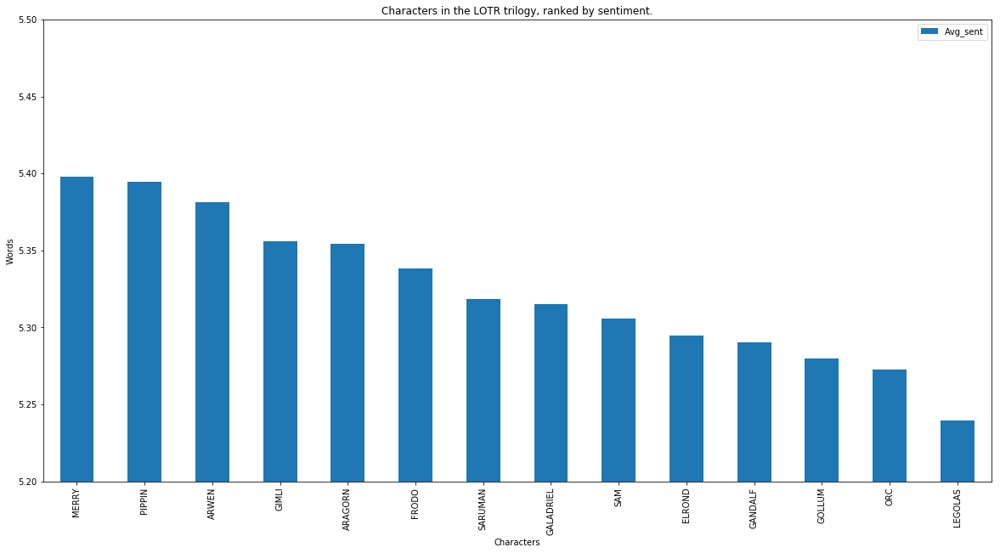
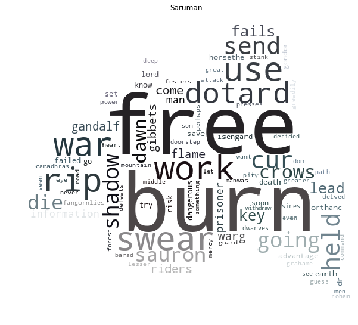

# Analyzing Lord of The Rings with Data Science

## Overview 

1. [Introduction](#1---introduction)
2. [Data](#2---data)
3. Networks
4. Basic Analysis
5. Community Detection
6. Text analysis
7. Sentiment analysis

## 1 - Introduction 



## 2 - Data
We divided our analysis in three different ones, based on the datasets we had.

#### 1. The fan Wiki of Lord of The Rings

From this wiki specific to Lord of The Rings we've downloaded all the wikipages of all the characters from the movies.

#### 2. Transcripts of the movie

We found a dataset, containing what the characters of the movies are saying. 

#### 3. Books

We downloaded the three books from J.R.R Tolkien.

#### Click here to dowload our datasets.

## 3 - Networks

#### 1. Network based on the link inside the wikipages

Nodes are the characters and edges are the link from the wikipage of one character to another one.

#### 2. Network based on the chapters of the books

Nodes are the characters and there is an edge between two characters each time there appear in the same chapter

## 4 - Basic Analysis 

To do for both of the networks

#### Who is the most connected charaters 

Here we have to :
- precise if there are differences between the graph and to interpret these differences
- Analyse the result 
- Find funny or weird result

#### Degree distribution

Here we have to:
- Analyse the results
- Explain a intersting fact to explain to the readers

## 5 - Community detection

Here we have to:
- Create community for the most relevant graph
- Analyse them and explain the results
- Create community based on race or culture
- Compare them
- And find the ties between community with cconfusion matrix

## 6 - Sentiment analysis

### 6.1 - Sentiment analysis over characters

We also wanted to know who are the nicest and badest guys in each book.

We performed a sentiment analysis over each book:

So for here are the most interesting results:

| Book                          | Top 3 Nicest        |Top 3 Baddest |
| -----------------------------:|--------------------:| -------:|
| The Fellowship of the Ring    | Bilbo, Pippin, Barliman        | Sam, Boromir, Saruman    |
| The Two Towers                | Boromir, Arwen, Soldier          | Grima, Smeagol, Orc    |
| The Return of The King        | Treebeard, Bilbo, Smeagol          | Gothmog, Eomer, Legolas    |

More generally, it appears that Bilbo is one of the nicest person in the Middle Earth but this analysis confirms what we were expecting, that Orcs and Saruman are the real bad guys of Lord of the Rings.

We can see that the most words most frequently said by Saruman are : Burn, Sauron, Fire (to complete)...

### 6.2 - Evolution of sentiments over the books

Thanks to the sentiment analysis we performed we are able to know when are the darkest and the happiest time of the story

We then try to know  what happens during these two moments: chapter X and chapter Y.
Then we performed a text analysis on those two chapters, here are the words clouds of these two chapters:

-->include word cloud when gandalf dies <--

-->include word cloud when merry and pippin are back <--

